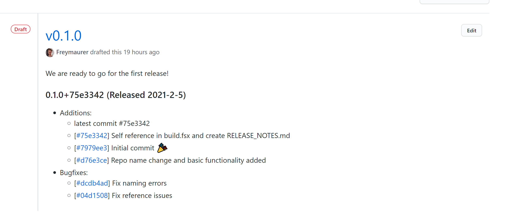

# Fake.Extensions.Release

A libary for extended release notes functions using FAKE.

- [Install/Use](#installuse)
- [Example build.fsx module](#example-buildfsx-module)
- [API](#api)
  - [ReleaseNotes.FAKE.AssemblyVersion.create](#releasenotesfakeassemblyversioncreate)
  - [ReleaseNotes.FAKE.Release.ensure](#releasenotesfakereleaseensure)
  - [ReleaseNotes.FAKE.Release.update](#releasenotesfakereleaseupdate)
  - [ReleaseNotes.FAKE.Github.draft](#releasenotesfakegithubdraft)
- [Release Notes in Nuget](#release-notes-in-nuget)

## Install/Use

### Dependency
This library requires [git](https://git-scm.com/downloads) to access your commit history.

| Package Name         | Nuget                                                                                                                |
| -------------------- | -------------------------------------------------------------------------------------------------------------------- |
| `Fake.Extensions.Release`           | [](https://www.nuget.org/packages/Fake.Extensions.Release/)                    |


## Example build.fsx module

While testing i ran into some erros that you might also encounter:
- When using BlackFox.Fake.BuildTask make sure to use `BuildTask.runOrDefaultWithArguments defaultTask`. When running standard Fake reference `Target.runOrDefaultWithArguments defaultTarget`. 

```fsharp
module ProjectInfo =
    
    let gitOwner = "Freymaurer"
    let gitName = "Fake.Extensions.Release"
```

```fsharp
module ReleaseNoteTasks =

    open Fake.Extensions.Release

    let createAssemblyVersion = BuildTask.create "createvfs" [] {
        AssemblyVersion.create ProjectInfo.gitName
    }

    let updateReleaseNotes = BuildTask.createFn "ReleaseNotes" [] (fun config ->
        ReleaseNotes.ensure()

        ReleaseNotes.update(ProjectInfo.gitOwner, ProjectInfo.gitName, config)
    )

    let githubDraft = BuildTask.createFn "GithubDraft" [] (fun config ->

        let body = "We are ready to go for the first release!"

        Github.draft(
            ProjectInfo.gitOwner,
            ProjectInfo.gitName,
            (Some body),
            None,
            config
        )
    )
```

## API

### AssemblyVersion.create

This function creates a AssemblyVersion.fs with the following content. It accesses the RELEASE_NOTES.md for version and date information. 

```fsharp
// Auto-Generated by FAKE; do not edit
namespace System
open System.Reflection

[<assembly: AssemblyTitleAttribute("Fake.Extensions.Release")>]
[<assembly: AssemblyVersionAttribute("0.2.0")>]
[<assembly: AssemblyMetadataAttribute("ReleaseDate","08/02/2021")>]
do ()

module internal AssemblyVersionInformation =
    let [<Literal>] AssemblyTitle = "Fake.Extensions.Release"
    let [<Literal>] AssemblyVersion = "0.2.0"
    let [<Literal>] AssemblyMetadata_ReleaseDate = "08/02/2021"
```

### Release.ensure 

This functions checks if RELEASE_NOTES.md exists on the same directory level and if not creates it with the following content.

```md
### 0.0.0 (Released 2021-2-5)
* Additions:
    * Initial set up for RELEASE_Notes.md
```

### Release.update

It takes optional parameters:

**Next SemVer:**
- 1.1.1 → `semver:patch` → increases 1.1.2
- 1.1.1 → `semver:minor` → increases 1.2.0
- 1.1.1 → `semver:major` → increases 2.0.0

**Next Prerelease**
- 1.1.1 → `pre:any.prerelease.youwant.01` → 1.1.1-any.prerelease.youwant.01

**Crawled last commits:**
- `n:integer` → Crawl last `integer` commits for last used commit. Default 30.
  - Example: `n:50` → Crawl last 50 commits.

The function will check all git commits since the last one used, and add them to the RELEASE_NOTES.md. If no additonal param is given then the latest commits are added to the latest release notes. If a optional param is given the version is increased and all not-yet-added commits are added to the new version.
In all cases the latest commit is added as additional metadata to SemVer in the RELEASE_NOTES.md. 

Here is an example from this repository.
```md
### 0.3.0+83f3e48 (Released 2022-7-25)
* Additions:
    * [[#ded1898](https://github.com/Freymaurer/Fake.Extensions.Release/commit/ded1898269a42af82c20faca79ac82528e10a5d0)] Add build.fsproj
    * [[#1dcc57b](https://github.com/Freymaurer/Fake.Extensions.Release/commit/1dcc57b78341e6fa452fad0b7b236af558fd0c9c)] Add unit tests :white_check_mark:
    * [[#e5823b3](https://github.com/Freymaurer/Fake.Extensions.Release/commit/e5823b347ab4a9ddad970d305abe79cb857e2234)] Update ReleasNote parsing with now correct SemVer :sparkles:
    * [[#23e6880](https://github.com/Freymaurer/Fake.Extensions.Release/commit/23e688001553162d8c21df85a12847cd706e640b)] Update README.md
    * [[#cc6d9ad](https://github.com/Freymaurer/Fake.Extensions.Release/commit/cc6d9ad66b6f6c9861ad3601396822283991e331)] Update README.md
* Deletions:
    * [[#83f3e48](https://github.com/Freymaurer/Fake.Extensions.Release/commit/83f3e487a03a2a7be75350e3a3c5a025171c2040)] Remove build.fsx logic

### 0.2.0+b0216ab (Released 2021-2-8)
* Additions:
    * latest commit #b0216ab // This was added due to a bug in Fake.ReleaseNotes, which is now fixed
    * [[#b0216ab](https://github.com/Freymaurer/Fake.Extensions.Release/commit/b0216abe97c2ac841cd40b6ee260790022c7e2e1)] Update README.md :books:
    * [[#55dc4b9](https://github.com/Freymaurer/Fake.Extensions.Release/commit/55dc4b9ba64eaf676809436f0e69f4a9106fa729)] Change library namespace (Issue #1).
* Bugfixes:
    * [[#819179e](https://github.com/Freymaurer/Fake.Extensions.Release/commit/819179eeb712cfbd2ebbecb6ad33fb35e371d085)] Fix nuget package release notes.
    * [[#9598d25](https://github.com/Freymaurer/Fake.Extensions.Release/commit/9598d25f00a4876e789a1e8d05919014feca3b03)] Fix hardcoded commit url (Issue #2).

```

### Github.draft

This function will use the latest release notes from RELEASE_NOTES.md and push them to a Github release draft. To do this the function needs an additional parameter `token:GithubToken`. Such a GithubToken can be created here: https://github.com/settings/tokens.
Alternatively you can set the GithubToken as environmental variable with the name `github_token`.

Exmp: `fake build -t githubdraft token:uniquetokenitdent`

This will create a github release draft with the latest release notes and a customizable body message shown above.



## Release Notes in Nuget

Should you use the generated RELEASE_NOTES.md to populate your nuget release notes you migth want to remove the commit urls as nuget does not parse markdown.

You cna do this with the following functions.

```fsharp
open System.Text.RegularExpressions

let commitLinkPattern = @"\[\[#[a-z0-9]*\]\(.*\)\] "

let replaceCommitLink input= Regex.Replace(input,commitLinkPattern,"")
```
